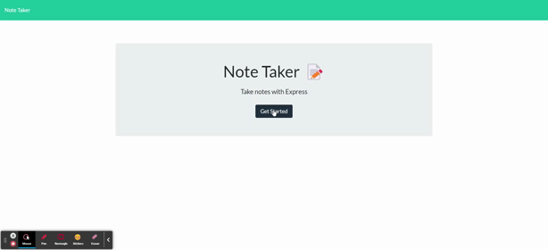

# Note Faker

## **Description**

Note Faker is an application built using a static json database backend to store input from a User Interface.

## Table of Contents

- [Installation](#installation)
- [Usage](#usage)
- [License](#license)
- [Questions](#questions)

## **Installation**

Note Faker requires Node.js v17.9.0 or later, esxpress, and nanoid as it's primary dependencies.

Download node from here:
>[node.js](https://nodejs.org/en/download/)

From your preferred terminal, navigate to the the project's root directory on your local drive. 

Type the following in to your terminal
>npm install 

The app is initialized via the User Interface in a web browser

## **Usage**

The application can be found at [note faker github](https://github.com/edellenator/note-faker)

and live at [note faker heroku](https://git.heroku.com/note-faker.git)

>

## Credits

- Erik Dell

## License

>Copyright <2022> Erik Dell
>
>Permission is hereby granted, free of charge, to any person obtaining a copy of this software and associated documentation files (the "Software"), to deal in the Software without restriction, including without limitation the rights to use, copy, modify, merge, publish, distribute, sublicense, and/or sell copies of the Software, and to permit persons to whom the Software is furnished to do so, subject to the following conditions:
>
>The above copyright notice and this permission notice shall be included in all copies or substantial portions of the Software.
>
>THE SOFTWARE IS PROVIDED "AS IS", WITHOUT WARRANTY OF ANY KIND, EXPRESS OR IMPLIED, INCLUDING BUT NOT LIMITED TO THE WARRANTIES OF MERCHANTABILITY, FITNESS FOR A PARTICULAR PURPOSE AND NONINFRINGEMENT. IN NO EVENT SHALL THE AUTHORS OR COPYRIGHT HOLDERS BE LIABLE FOR ANY CLAIM, DAMAGES OR OTHER LIABILITY, WHETHER IN AN ACTION OF CONTRACT, TORT OR OTHERWISE, ARISING FROM, OUT OF OR IN CONNECTION WITH THE SOFTWARE OR THE USE OR OTHER DEALINGS IN THE SOFTWARE.

## Questions

You can find me at my [github](https://github.com/edellenator)

Or you can email me at:

edellenator@gmail.com

